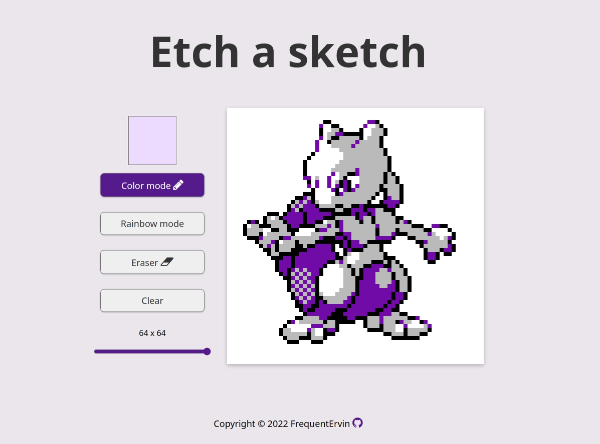

# etch-a-sketch

A sketch app for pixel art. Basic, yet shick. 
# TO-DO: 
1. Add bucket button, implement with flood-fill (in another branch)
2. Add UNDO
3. Add Save file
# Preview: 

# License
[MIT](https://choosealicense.com/licenses/mit/)
